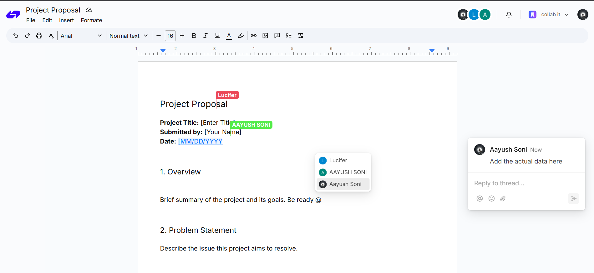

# 📄 Docs – Real-Time Collaborative Editor

[Live Demo 🚀](https://docs-iota-navy.vercel.app/)

---

## 📝 Overview

**Docs** is a sleek, real-time collaborative document editor designed for modern teams and individuals. It includes essential formatting tools for rich text editing, and enables seamless collaboration through live updates, user tagging in comments, and dynamic document syncing.

Whether you're drafting solo or collaborating within your organization, Docs adapts to your workflow with intelligent permission handling and a user-friendly interface.

---

## 🔧 Tech Stack

- **Next.js** – App framework
- **Clerk** – Authentication (users & organizations)
- **Convex** – Real-time backend & database
- **Tiptap** – Rich-text editor
- **Liveblocks** – Real-time collaboration and presence
- **Tailwind CSS** – Modern utility-first styling

---

## ✨ Key Features

- 🧠 **Real-Time Collaboration**  
  See updates instantly as others type, select, and edit — no refresh required.

- 🔐 **Clerk Authentication**  
  Secure sign-in with personal or organization accounts.

- 🏢 **Organization-Based Documents**  
  Share and collaborate on documents within your org. Only members have access.

- 🎨 **Rich Text Editing**  
  Use formatting tools like bold, italics, headings, and more via the Tiptap editor.

- 💬 **Commenting with Mentions**  
  Tag other users and leave feedback inline or on sections of the document.

- ⚡ **Live Presence Indicators**  
  Know who’s viewing or editing in real time.

---

## 🛠️ Future Enhancements

- Version history
- Export to PDF/Markdown
- More user roles (e.g., Viewer, Editor, Admin)
- Offline support

---

## 📬 Feedback

Feel free to open issues or suggestions. This project is built for modern collaboration, and improvements are always welcome!

---
